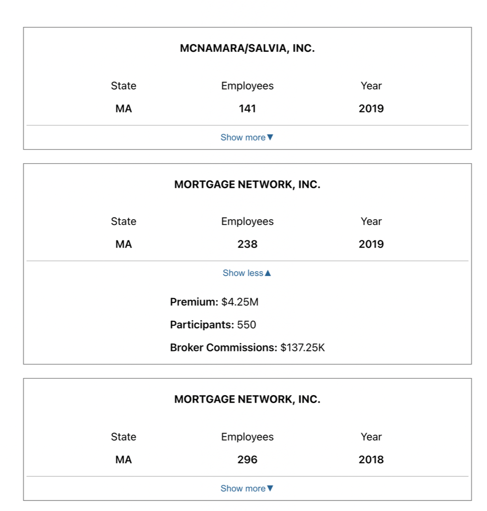

# Nava

[Deployed app](https://nava-gilt.vercel.app/)
## Setup

First, run the development server:

```bash
npm run dev
# or
yarn dev
```

### Instructions

Requirements:

- The cards containing company data should be centered on the page
- Each card should display the company name, company state, plan year, and employee count
- Clicking "More details" should display the premium sum, broker commission, and number of participants

##### Desktop Mockups:

